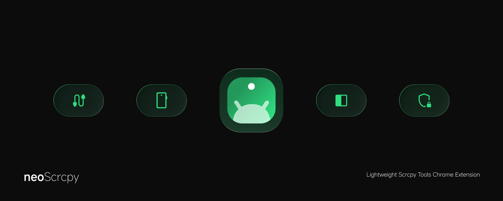

# browser-scrcpy


browser-scrcpy 是一个基于 Chrome MV3 的 Android 投屏与控制扩展。它通过 WebADB/WebUSB 连接 Android 设备，并使用 scrcpy 在浏览器侧边栏中显示和控制手机屏幕。

当前可用项目位于 `chrome-extension/`。构建时需要的扩展资源、图标、引导图片以及 `scrcpy-server-v2.4` 都保存在该目录内，构建后会被复制到 `chrome-extension/dist/`。

## 功能特性

- 通过 Chrome 侧边栏进行 Android 屏幕镜像与触控控制
- 使用 WebADB/WebUSB 直接申请 USB ADB 权限
- 支持扩展弹窗、侧边栏、设置页与独立授权页
- 支持最近设备记录、快速重连
- 支持文件管理、APK 安装、ADB shell 命令等设备工具
- 支持浏览器级小窗（Document Picture-in-Picture）
- 支持浅色、深色、跟随系统主题
- 内置 `scrcpy-server-v2.4`，构建后随扩展一起分发

## 环境要求

- Node.js 18 或更高版本
- npm
- Chrome 116 或更高版本，并支持 WebUSB
- Android 5.0 或更高版本
- 已开启“开发者选项”和“USB 调试”的 Android 设备
- 一根可传输数据的 USB 数据线

Windows 用户如果无法发现设备，请先确认设备厂商 USB 驱动或通用 ADB 驱动已正确安装。

## 项目结构

```text
browser-scrcpy/
├─ README.md
├─ chrome-extension/
│  ├─ manifest.json
│  ├─ package.json
│  ├─ vite.config.ts
│  ├─ scripts/
│  │  └─ postbuild.mjs
│  ├─ src/
│  │  ├─ pages/
│  │  ├─ shared/
│  │  ├─ styles/
│  │  └─ ui/
│  └─ vendor/
│     └─ scrcpy-server-v2.4
└─ reference-file/
```

主要目录说明：

- `chrome-extension/`：Chrome 扩展源码、构建配置、清单文件和依赖配置。
- `chrome-extension/src/`：React + TypeScript 编写的扩展 UI 与共享逻辑。
- `chrome-extension/src/pages/`：弹窗、侧边栏、设置页、授权页、小窗页等页面入口。
- `chrome-extension/src/shared/`：WebADB、scrcpy、存储、主题、国际化等共享模块。
- `chrome-extension/src/assets/`：欢迎页、引导页和 UI 使用的图片资源。
- `chrome-extension/vendor/scrcpy-server-v2.4`：随扩展打包的 scrcpy 服务端文件。
- `chrome-extension/scripts/postbuild.mjs`：构建后复制 manifest、图标、资源和 scrcpy server 到 `dist`。

## 安装依赖

```bash
cd chrome-extension
npm install
```

## 本地构建

```bash
cd chrome-extension
npm run build
```

构建完成后，可加载的扩展目录为：

```text
chrome-extension/dist
```

## 在 Chrome 中加载扩展

1. 打开 `chrome://extensions/`。
2. 打开右上角“开发者模式”。
3. 点击“加载已解压的扩展程序”。
4. 选择 `chrome-extension/dist`。
5. 加载后点击浏览器工具栏中的 neoScrcpy 图标，或在网页中右键打开 neoScrcpy 侧边栏。

如果修改了源码，需要重新执行 `npm run build`，然后在 `chrome://extensions/` 中点击该扩展的“重新加载”。

## 使用方式

1. 使用 USB 数据线连接 Android 设备。
2. 在手机上开启“USB 调试”，并保持屏幕解锁。
3. 打开 neoScrcpy 侧边栏或授权页。
4. 点击“连接设备”。
5. 在 Chrome 的 USB 设备选择框中选择手机。
6. 在手机上确认 USB 调试授权。
7. 连接成功后即可在侧边栏中查看和控制设备屏幕。

部分 Android 设备还需要额外设置：

- 小米/MIUI：如果鼠标控制无效，请在开发者选项中开启“USB 调试（安全设置）”。
- Windows：如果 Chrome 找不到设备，请检查手机驱动、ADB 驱动以及是否有其他程序占用了 ADB。

## 常用脚本

在 `chrome-extension/` 目录中执行：

```bash
npm run dev
npm run build
npm run preview
```

- `npm run dev`：启动 Vite 开发服务，主要用于调试页面 UI。
- `npm run build`：构建扩展，并执行 postbuild 复制扩展资源。
- `npm run preview`：预览 Vite 构建产物，不等同于完整 Chrome 扩展加载。

Chrome 扩展最终仍应通过 `chrome-extension/dist` 以“加载已解压的扩展程序”的方式验证。

## 故障排查

### 找不到设备

- 确认手机已开启 USB 调试。
- 拔插 USB 数据线后重试。
- 保持手机屏幕解锁，并在手机上确认授权弹窗。
- 在手机开发者选项中撤销 USB 调试授权，再重新连接。
- Windows 下检查设备驱动是否正常。
- 关闭 Android Studio、桌面版 scrcpy、手机助手、独立 `adb.exe` 等可能占用设备的程序。

### 连接后立即断开

- 更换质量更好的数据线。
- 更换 USB 接口。
- 关闭其他 ADB 程序。
- 在扩展中重置连接状态后重新授权。
- 重启 Chrome 后再试。

### 扩展加载失败

- 确认加载的是 `chrome-extension/dist`，不是源码目录。
- 重新执行 `npm run build`。
- 查看 `chrome://extensions/` 中该扩展的错误信息。
- 点击 service worker 链接查看后台日志。

## 发布打包

发布或手动分发时，只打包 `chrome-extension/dist/` 中的内容。

不要提交或分发以下内容：

- `node_modules/`
- `chrome-extension/dist/`
- `*.crx`
- `*.zip`
- `.env*`
- `*.pem`

如果要作为开源项目发布，请先补充合适的 `LICENSE` 文件。

## 第三方依赖

项目使用 WebADB、Yume Chan 的 ADB/scrcpy 相关库、React、Vite、Tailwind CSS 等依赖。第三方许可证信息见：

```text
chrome-extension/THIRD_PARTY_LICENSES.txt
```

## 说明

本项目依赖浏览器原生 WebUSB 能力，设备访问权限由用户在 Chrome 的 USB 授权弹窗中显式授予。扩展的 `manifest.json` 不需要配置 `host_permissions` 才能使用 WebUSB。

Chrome 可能会因为扩展声明了 `tabs` 权限而提示“读取浏览历史记录”。neoScrcpy 不会读取、收集或上传浏览历史记录；该权限仅用于打开扩展页面、管理扩展自身创建的页面，以及避免重复打开相同的扩展页面。

## 下载
你可访问 [ Chrome 浏览器插件商店 ](https://chromewebstore.google.com/detail/neoscrcpy/hdeiefibhnoebfoeddkeihdblkjgifoe) 来下载安装插件。
